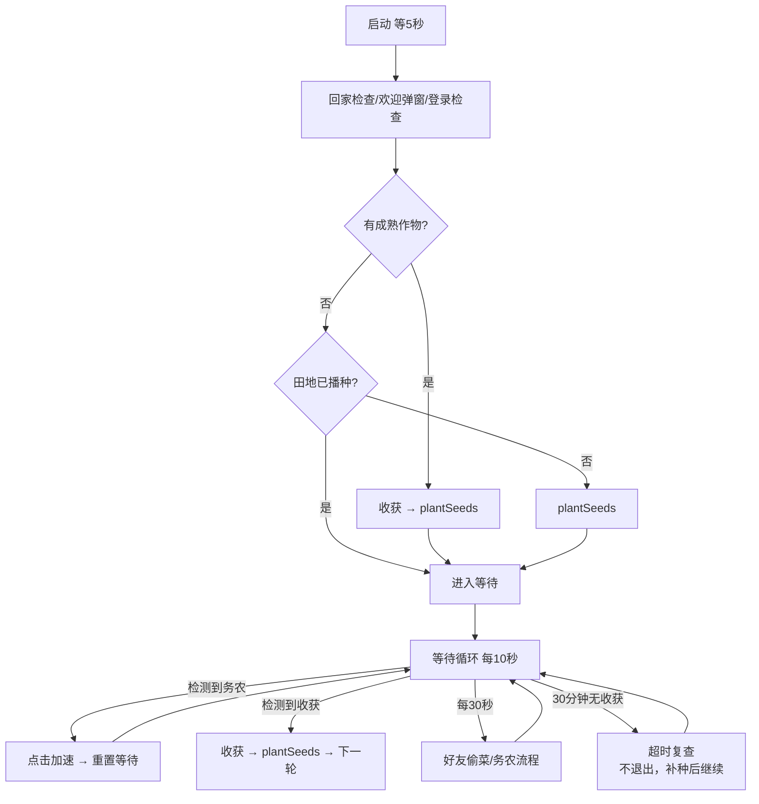

# QQ农场自动化脚本

基于**屏幕图像识别 + 鼠标模拟**的 QQ农场（手游投屏版）自动化工具：挂在电脑上自动完成收获、播种、买种，等待期间自动去好友农场偷菜/帮忙务农，并把关键动作写入统计日志，可按时间段回溯"收了几次、种了几次、偷了几次"。

> ⚠️ **使用须知**：本项目仅供学习与个人使用，自动化操作存在账号风控风险，后果自负；投屏窗口位置/分辨率变化后需要重新标定坐标与模板。

## 功能特性

| 模块 | 说明 |
|---|---|
| 启动自检 | 自动回家（防停留在好友农场）、关欢迎弹窗、处理登录失败弹窗 |
| 收获 | 检测「一键收获」按钮并点击；成熟判定基于模板匹配 |
| 智能播种 | `plantSeeds()` 优先种背包已有种子，种子栏提示"没有种子"才进商店购买 |
| 等待循环 | 每 10 秒检测 一键务农 / 一键收获；等待期每 30 秒自动拜访好友偷菜+务农 |
| 好友拜访 | 好友列表角标识别 → 同行配对「拜访」按钮 → 进田 → 一键偷菜/务农 → 回家；列表开关带验证与自愈 |
| 超时恢复 | 等待 30 分钟未成熟**不退出**：复查田地（收获/已播种/空闲补种）后继续下一轮 |
| 统计日志 | `logs/stats.log` 记录关键事件（含时间戳），可按时间段统计 |

## 环境要求

- **Windows**（依赖 `java.awt.Robot` 全局鼠标控制）
- **JDK 25+**（开发机路径示例：`C:\Users\<你>\.jdks\openjdk-25.0.2`）
- **Maven 3.9+**（或使用 `~/.m2/wrapper` 下的发行版）
- **IDEA**（日常开发与运行）
- 投屏软件已连接、游戏画面停留在电脑上（识别基于**全屏截图**，非游戏内接口）

## 快速开始

### IDEA（推荐）

1. 打开项目，等待 Maven 依赖同步（首次需下载 OpenCV 平台包，体积较大）
2. 确认 Project SDK = JDK 25，注解处理（Lombok）默认开启
3. 运行 `org.Main`（注意启动前投屏画面就绪，程序有 5 秒等待）

### 命令行

```powershell
$env:JAVA_HOME = "C:\Users\<你>\.jdks\openjdk-25.0.2"
mvn compile
mvn exec:java -Dexec.mainClass="org.Main"
```

> 若 CLI 编译报 `找不到符号: 变量 log`，检查 `pom.xml`：编译插件必须在 `<build><plugins>` 中，并配置 `<proc>full</proc>` + lombok 注解处理器路径（JDK 23+ 默认关闭注解处理）。

## 项目结构

```
src/main/java/org/
├── Main.java                     # 入口：5秒等待 → QQFarmController.run()
├── config/CoordinateConfig.java  # properties 读取（getInt/getPoint/getScreenBounds）
├── core/
│   ├── ImageMatcher.java         # OpenCV 多尺度模板匹配（灰度 TM_CCOEFF_NORMED）
│   ├── MouseController.java      # 鼠标移动/点击/拖拽（moveToAndClick 内含2秒等待）
│   ├── StatsLog.java             # 统计事件追加写 logs/stats.log
│   └── StatusWindow.java         # 浮动状态窗
└── game/
    ├── QQFarmController.java     # 主流程编排（启动检查+等待循环+超时复查）
    ├── config/GameConfig.java    # 常量：全部几何值从 properties 读取，仅图片路径/时间参数留此
    └── actions/                  # 动作单元：Harvest/BuySeed/SowSeed/GoHome/
                                  # VisitFriend/FieldCheck/LoginCheck/WelcomeDialog
src/main/resources/
├── QQFarmCoordinates.properties  # ★ 所有屏幕坐标（单一数据源）
└── images/                       # 模板图片（按功能分目录）
src/test/java/org/test/           # 工具与 demo（见下文）
index.html / style.css / app.js   # 坐标标定工具（浏览器打开）
```

## 主流程



`plantSeeds()` 语义：**先直接尝试播种（点田→点种子一键种植）；失败（种子栏提示无种子）才进商店购买后重播**——保证不为"已种/有存货"的场景乱花钱。

## 配置说明

### QQFarmCoordinates.properties（坐标单一数据源）

| 键 | 状态 | 用途 |
|---|---|---|
| `qqFarm.store.location` | 在用 | 主界面商店按钮 |
| `qqFarm.first.field.location` | 在用 | 第一块田（弹种子栏/田检） |
| `qqFarm.field.check.exit` | 在用 | 田检退出点（点空白） |
| `qqFarm.fieldArea.*`（四角+4×6） | 在用 | ★田区网格：扫描播种 demo 算 24 中心 |
| `qqFarm.seedGrid.*`（四角+cols/rows） | 在用 | 商店种子网格扫描（经 GameConfig.GRID_*） |
| `qqFarm.badge.offset.*` | 在用 | 角标→种子中心偏移 |
| `qqFarm.screen.*` 四角 | 备用 | 投屏边界（getScreenBounds，检测区域限定用） |
| `qqFarm.seedBar.*` | 未使用 | 旧固定种子栏区域（已改动态搜索） |
| `qqFarm.store.confirms/close`、`only.seed`、`second~sixth.field` | 遗留 | 旧逻辑残留，读不到不影响运行 |

改坐标：直接改 properties 重新编译，或用**标定工具**（见下节）。改动投屏窗口后，坐标和模板图通常都要重标。

### GameConfig 中仍保留在 Java 的参数

- 时间：`FRIEND_VISIT_INTERVAL_MS`（偷菜间隔30s）、`HARVEST_WAIT_TIME`；主流程内 `checkInterval=10s`、`maxWaitTime=30min`
- 模板图片路径（`IMG_*`）、匹配阈值（ImageMatcher 0.8、角标0.6、拜访按钮0.65）

### 图像模板（`src/main/resources/images/`）

- 根目录：一键收获/务农、商店锁/关闭/购买确认、种子角标、小铲子、欢迎关闭、重新登录、主页好友、求助页回家、油菜等
- `好友/`：偷菜角标、务农角标、拜访按钮、关闭按钮
- `好友田地/`：一键偷菜按钮、一键务农按钮
- `个人田地页面/`：**空田模版.png**（扫描播种判空纹理基准）、**点击田地无种子截图.png**（无种子提示条，点击直达商店）

## 统计日志（logs/stats.log）

格式：`yyyy-MM-dd HH:mm:ss | 事件 | 详情`，仅记关键行。事件一览：

| 事件 | 含义 |
|---|---|
| `RUN_START` / `ROUND_START` / `WAIT_TIMEOUT` | 启动 / 轮次 / 30分钟复查点 |
| `HARVEST` / `BUY_SEED` / `SOW` | 实际点击收获 / 确认购买 / 播种完成 |
| `FRIEND_HELP`（已随求助功能移除）、`FARM_CLICK source=wait\|friend` | 一键务农点击 |
| `VISIT` / `STEAL` | 拜访好友 / 一键偷菜 |
| `VISIT_ABORT 原因` | 好友流程中止原因（no_badge / pair_failed_steal / not_entered_farm…） |
| `GO_HOME` | 点击回家 |
| `RELOGIN` | 点击重新登录 |

统计示例：想知道某时间段偷了几次 → 打开 `logs/stats.log` 过滤该时间段的 `STEAL` 行数即可。

## 坐标标定工具

浏览器直接打开根目录 `index.html`：

- 19 个坐标键的**中文含义/使用状态/代码引用位置**，可编辑 X/Y
- 左侧实时示意图：投屏四边形、商店网格、种子栏、越界红色警示
- 「生成配置并复制」→ 整体覆盖粘贴回 properties

## 测试与 Demo（src/test/java/org/test/）

| 类 | 用途 | 运行方式 |
|---|---|---|
| `FieldPlantScanDemo` | ★田地扫描：24格明细+标注截图，**不点鼠标** | IDEA 右键 |
| `FieldPlantDemo` | ★扫描-播种全循环：点空田→种/买→重扫 | IDEA 右键 |
| `FriendStealBadgeDemo` | 好友偷菜链路验证 | IDEA 右键 |
| `CropDetectTest` | 收获/务农按钮识别自检 | IDEA 右键 |
| `MouseCoordinateDisplay` | 鼠标坐标悬浮显示（标定用，ESC退出） | IDEA 右键 |

### 田地扫描-播种算法（进行中，验证后合入主流程）

1. **网格**：properties `fieldArea` 四角 → 双线性插值算 4×6=24 个中心，整格取样窗
2. **特征**：绿色植被占比（HSV启发式）、白色像素占比、**多尺度(0.6~1.3x)灰度归一化纹理匹配** vs 空田模版
3. **判定链**：
   1. 手激活（白≥8%）且为 M（白最高格）→ **未知**（唯一，本轮跳过）
   2. T = M 同行左侧格 → **空田**（手势提示指向的目标）
   3. 绿≥5% → 在长
   4. 纹理≥0.8 → 空田
   5. 低分 → **在长**（成熟作物不一定绿，低分本身就是"有东西"）
4. **兜底**：点到在长的田只会弹小铲子 → 跳过换下一块；种子栏三态：角标（动态搜索点击种植）/ 无种子文字（点击进店买）/ 铲子
5. 阈值常量在类顶部；诊断输出：每格明细（绿/白/匹配分@档位）、手规则行、分数分布、标注截图 `target/field_debug/`

**已知 TODO**（代码内注释）：手势目标在**最右列**时，手会落到田区右侧边界外，白像素采不到、手加成失效——需在右缘外加虚拟采样带。

## 开发规范

- **提交**：Conventional Commits（`feat:` / `fix:` / `chore:` / `docs:`）+ 中文描述；一次提交 = 一个完整变更；跑通再提交
- **推送**：需明确要求才 push；仓库为 Private
- **不入库**：`target/`、`logs/`、`.mimocode/`、`.claude/`、IDEA 私有文件（.gitignore 已配置）
- **禁止**：改动主流程逻辑需先在 demo 验证；模板图片以用户提供的为准直接使用

## 路线图

- [ ] 扫描-播种 demo 全循环通过 → 合入主流程（替换 SowSeedAction、拆分 BuySeedAction 店内购买、退役 FieldCheckAction）
- [ ] 最右列手加成虚拟采样带（TODO 已记）
- [ ] 黑土地空田模板（若出现 UNKNOWN 误判在长）
- [ ] 治本：按当前画面重截弱匹配模板（拜访按钮等仍靠放宽阈值撑着）
